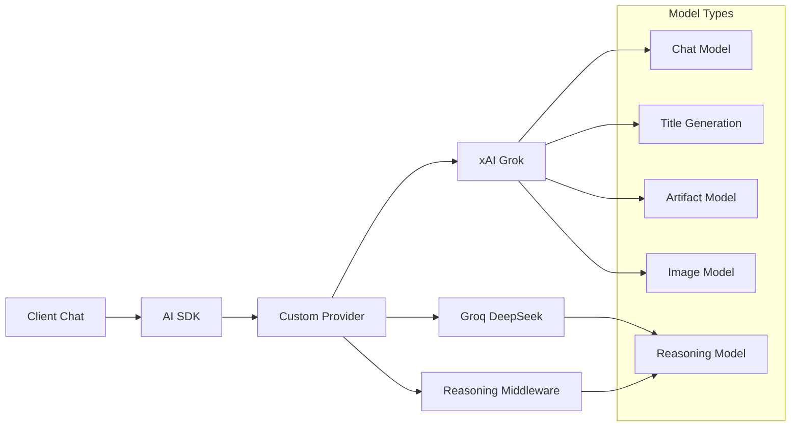

# AI Integration

## Overview

The application integrates with multiple AI providers through the **AI SDK by Vercel**, providing a unified interface for chat completions, streaming responses, and advanced AI features like reasoning and tool usage.

## AI Architecture



## Provider Configuration

### File Structure
```
src/lib/server/ai/
├── models.ts          # AI provider setup
├── prompts.ts         # System prompts
└── utils.ts           # AI utilities
```

### Custom Provider Setup
**Location**: `src/lib/server/ai/models.ts`

```typescript
import { createXai } from '@ai-sdk/xai';
import { createGroq } from '@ai-sdk/groq';
import { customProvider, extractReasoningMiddleware, wrapLanguageModel } from 'ai';

const xai = createXai({ apiKey: XAI_API_KEY });
const groq = createGroq({ apiKey: GROQ_API_KEY });

export const myProvider = customProvider({
    languageModels: {
        'chat-model': xai('grok-2-1212'),
        'chat-model-reasoning': wrapLanguageModel({
            model: groq('deepseek-r1-distill-llama-70b'),
            middleware: extractReasoningMiddleware({ tagName: 'think' })
        }),
        'title-model': xai('grok-2-1212'),
        'artifact-model': xai('grok-2-1212')
    },
    imageModels: {
        'small-model': xai.image('grok-2-image')
    }
});
```

### Available Models

#### Language Models
```typescript
interface ModelConfig {
    'chat-model': 'grok-2-1212';           // Primary chat model (xAI)
    'chat-model-reasoning': 'deepseek-r1'; // Reasoning model (Groq)
    'title-model': 'grok-2-1212';         // Title generation
    'artifact-model': 'grok-2-1212';      // Code/document generation
}
```

#### Image Models
```typescript
interface ImageModelConfig {
    'small-model': 'grok-2-image';  // Image generation (xAI)
}
```

## Chat Streaming Implementation

### API Endpoint
**Location**: `src/routes/(chat)/api/chat/+server.ts`

```typescript
export async function POST({ request, locals: { user }, cookies }) {
    const { id, messages } = await request.json();
    const selectedChatModel = cookies.get('selected-model');
    
    return createDataStreamResponse({
        execute: (dataStream) => {
            const result = streamText({
                model: myProvider.languageModel(selectedChatModel),
                system: systemPrompt({ selectedChatModel }),
                messages,
                maxSteps: 5,
                experimental_transform: smoothStream({ chunking: 'word' }),
                experimental_generateMessageId: crypto.randomUUID.bind(crypto),
                onFinish: async ({ response }) => {
                    // Save messages to database
                    await saveMessages({ messages: [...] });
                }
            });
            
            result.mergeIntoDataStream(dataStream, {
                sendReasoning: true
            });
        }
    });
}
```

### Streaming Features

#### Smooth Streaming
```typescript
experimental_transform: smoothStream({ 
    chunking: 'word'  // Stream word by word for better UX
})
```

#### Reasoning Support
```typescript
// For reasoning models, include thinking process
result.mergeIntoDataStream(dataStream, {
    sendReasoning: true  // Include <think> tags content
});
```

## System Prompts

### Prompt Configuration
**Location**: `src/lib/server/ai/prompts.ts`

```typescript
export const regularPrompt = 
    'You are a friendly assistant! Keep your responses concise and helpful.';

export const systemPrompt = ({ selectedChatModel }: { selectedChatModel: string }) => {
    if (selectedChatModel === 'chat-model-reasoning') {
        return regularPrompt;
    } else {
        return regularPrompt;
        // return `${regularPrompt}\n\n${artifactsPrompt}`;
    }
};
```

### Code Generation Prompt
```typescript
export const codePrompt = `
You are a Python code generator that creates self-contained, executable code snippets. When writing code:

1. Each snippet should be complete and runnable on its own
2. Prefer using print() statements to display outputs
3. Include helpful comments explaining the code
4. Keep snippets concise (generally under 15 lines)
5. Avoid external dependencies - use Python standard library
6. Handle potential errors gracefully
7. Return meaningful output that demonstrates the code's functionality
8. Don't use input() or other interactive functions
9. Don't access files or network resources
10. Don't use infinite loops
`;
```

### Document Update Prompt
```typescript
export const updateDocumentPrompt = (currentContent: string | null, type: ArtifactKind) =>
    type === 'code'
        ? `Improve the following code snippet based on the given prompt.\n\n${currentContent}`
        : `Improve the following contents of the document based on the given prompt.\n\n${currentContent}`;
```

## Client-side Integration

### AI SDK Svelte Integration
**Location**: `src/lib/components/chat.svelte`

```typescript
import { Chat } from '@ai-sdk/svelte';

const chatClient = $derived(
    new Chat({
        id: chat?.id,
        initialMessages: untrack(() => initialMessages),
        sendExtraMessageFields: true,
        generateId: crypto.randomUUID.bind(crypto),
        onFinish: async () => {
            await chatHistory.refetch();
        },
        onError: (error) => {
            try {
                const jsonError = JSON.parse(error.message);
                toast.error(jsonError.message);
            } catch {
                toast.error(error.message);
            }
        }
    })
);
```

### Message State Management
```typescript
// Chat client provides reactive state
const messages = chatClient.messages;  // Reactive message array
const status = chatClient.status;      // 'idle' | 'streaming' | 'submitted'
const isLoading = $derived(status === 'streaming' || status === 'submitted');
```

### Multimodal Input
```typescript
// File attachments support
let attachments = $state<Attachment[]>([]);

// Submit with attachments
await chatClient.append({
    role: 'user',
    content: inputValue,
    experimental_attachments: attachments
});
```

## Model Selection

### Client-side Model Selector
**Location**: `src/lib/components/model-selector.svelte`

```typescript
interface ModelOption {
    id: string;
    name: string;
    description: string;
}

export const chatModels: Array<ModelOption> = [
    {
        id: 'chat-model',
        name: 'Chat model',
        description: 'Primary model for all-purpose chat'
    },
    {
        id: 'chat-model-reasoning',
        name: 'Reasoning model', 
        description: 'Uses advanced reasoning'
    }
];
```

### Cookie-based Selection
```typescript
// Store selection in cookie for server access
document.cookie = `selected-model=${modelId}; path=/; SameSite=Lax`;
```

## Advanced Features

### Tool Integration (Planned)
```typescript
// Currently disabled but structure exists
experimental_activeTools: [],
// tools: {
//     getWeather,
//     createDocument: createDocument({ session, dataStream }),
//     updateDocument: updateDocument({ session, dataStream }),
//     requestSuggestions: requestSuggestions({ session, dataStream })
// },
```

### Reasoning Model Middleware
```typescript
const reasoningModel = wrapLanguageModel({
    model: groq('deepseek-r1-distill-llama-70b'),
    middleware: extractReasoningMiddleware({ 
        tagName: 'think'  // Extract content between <think> tags
    })
});
```

### Title Generation
```typescript
export async function* generateTitleFromUserMessage({ 
    message 
}: { 
    message: UIMessage 
}): AsyncGenerator<string, string, unknown> {
    const result = yield* safeTry(async function* () {
        const { text } = yield* generateText({
            model: myProvider.languageModel('title-model'),
            system: 'Generate a concise title for this conversation (max 8 words)',
            prompt: getMostRecentUserMessage([message])?.content || ''
        });
        return ok(text);
    });
    
    return result.unwrapOr('New Chat');
}
```

## Error Handling

### API Error Responses
```typescript
onError: (error) => {
    try {
        // Parse structured error from API
        const jsonError = JSON.parse(error.message);
        if (jsonError.message) {
            toast.error(jsonError.message);
        }
    } catch {
        // Fallback to raw error message
        toast.error(error.message);
    }
}
```

### Server Error Handling
```typescript
return createDataStreamResponse({
    execute: (dataStream) => {
        // AI streaming logic
    },
    onError: (e) => {
        console.error(e);
        return 'Oops! Something went wrong with the AI response.';
    }
});
```

## Configuration

### Environment Variables
```bash
# Required for AI providers
XAI_API_KEY=xai-your-api-key-here
GROQ_API_KEY=gsk_your-groq-key-here

# Optional: Model configuration
DEFAULT_CHAT_MODEL=chat-model
```

### Model Switching
```typescript
// Users can switch models via UI
// Selection persists via cookies
// Server reads cookie to determine which model to use
const selectedChatModel = cookies.get('selected-model') || DEFAULT_CHAT_MODEL;
```

## Performance Optimization

### Streaming Optimization
```typescript
// Word-based chunking for smoother streaming
experimental_transform: smoothStream({ 
    chunking: 'word' 
});

// Efficient message ID generation
experimental_generateMessageId: crypto.randomUUID.bind(crypto);
```

### Memory Management
```typescript
// Use untrack to prevent unnecessary reactivity
initialMessages: untrack(() => initialMessages);

// Efficient message state updates
const chatClient = $derived(new Chat({
    // Only recreate when chat ID changes
    id: chat?.id,
    // ... configuration
}));
```

## Testing AI Features

### Mock AI Responses
```typescript
// Mock the AI provider for testing
const mockProvider = {
    languageModel: () => ({
        stream: () => mockStream([
            { type: 'text', content: 'Hello' },
            { type: 'text', content: ' world!' },
            { type: 'finish', finishReason: 'stop' }
        ])
    })
};
```

### Integration Testing
```typescript
test('chat streaming', async () => {
    const response = await fetch('/api/chat', {
        method: 'POST',
        body: JSON.stringify({
            id: 'test-chat',
            messages: [{ role: 'user', content: 'Hello' }]
        })
    });
    
    expect(response.headers.get('content-type')).toContain('text/plain');
    
    const reader = response.body?.getReader();
    const chunks = [];
    while (true) {
        const { done, value } = await reader.read();
        if (done) break;
        chunks.push(new TextDecoder().decode(value));
    }
    
    expect(chunks.length).toBeGreaterThan(0);
});
```

## Future Enhancements

### Planned Features
- **Tool Usage**: Function calling for external APIs
- **Multi-modal**: Image and file processing
- **Custom Models**: Support for local/self-hosted models  
- **Rate Limiting**: Per-user usage limits
- **Analytics**: Token usage and model performance tracking

### Model Expansion
```typescript
// Additional providers can be easily added
const anthropic = createAnthropic({ apiKey: ANTHROPIC_API_KEY });
const openai = createOpenAI({ apiKey: OPENAI_API_KEY });

// Add to custom provider
languageModels: {
    'claude-3': anthropic('claude-3-sonnet-20240229'),
    'gpt-4': openai('gpt-4-turbo-preview'),
    // ... existing models
}
``` 