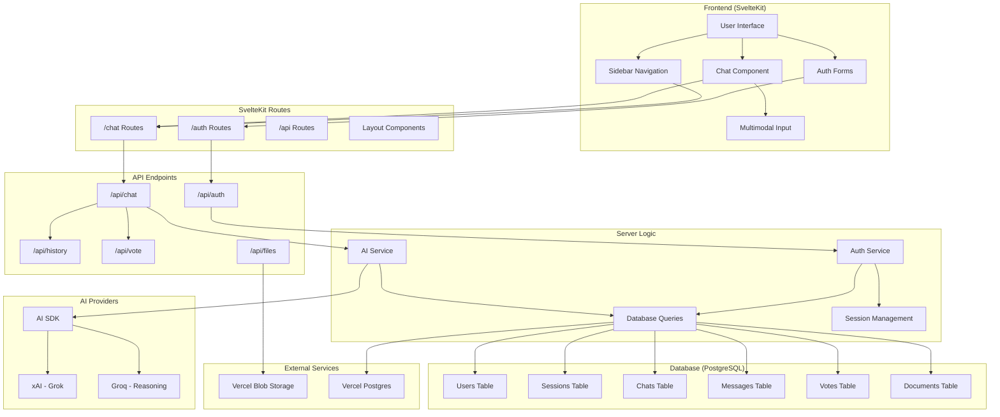
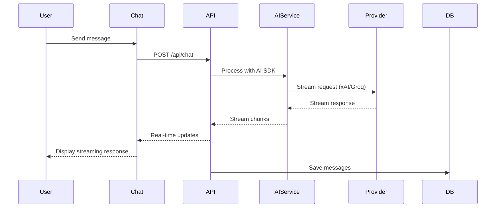
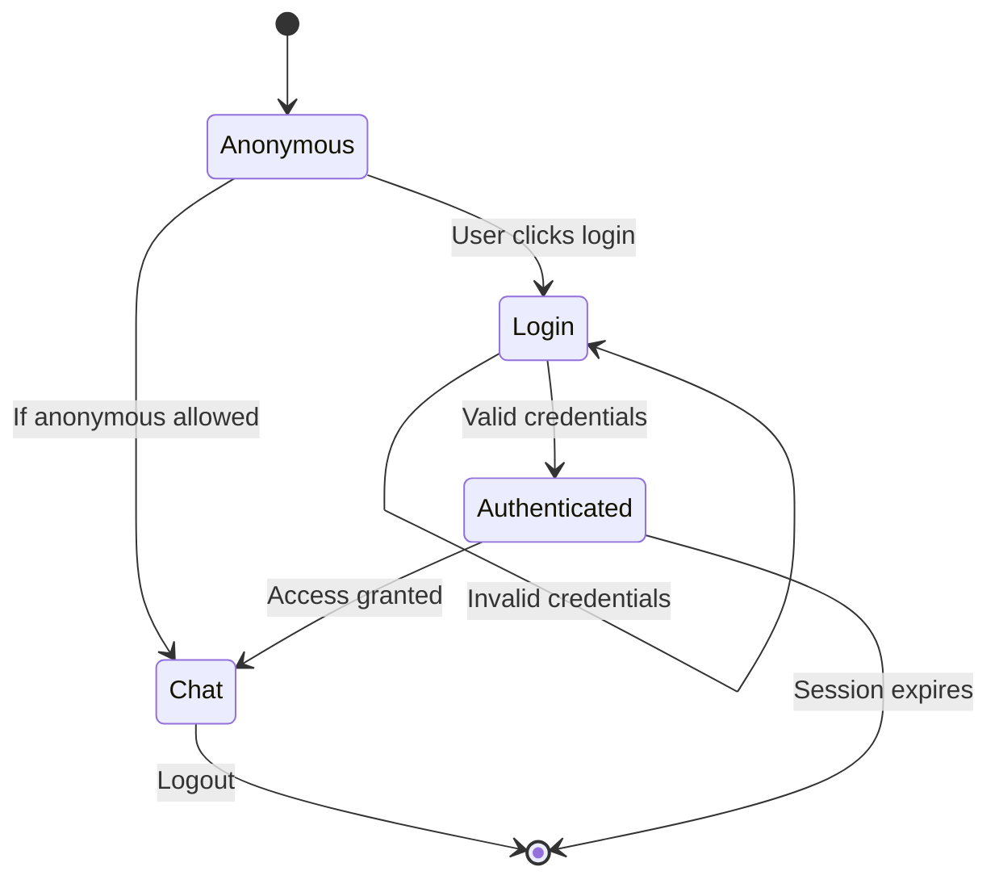

# Architecture Overview

## System Architecture Diagram



## Component Hierarchy

### Frontend Architecture
```
src/routes/
├── +layout.svelte (Root layout with themes)
├── (auth)/
│   ├── +layout.svelte (Auth layout)
│   └── [authType]/+page.svelte (Login/Register)
└── (chat)/
    ├── +layout.svelte (Chat layout with sidebar)
    ├── +page.svelte (New chat page)
    └── chat/[chatId]/+page.svelte (Existing chat)
```

### Component Tree
```
App
├── ThemeProvider
├── Toaster
└── Router
    ├── AuthLayout
    │   └── AuthForm
    └── ChatLayout
        ├── AppSidebar
        │   ├── SidebarUserNav
        │   └── SidebarHistory
        └── SidebarInset
            ├── ChatHeader
            ├── Chat
            │   ├── Messages
            │   └── MultimodalInput
            └── SuggestedActions
```

## Data Flow Architecture

### Request Flow
1. **User Input** → Frontend Component
2. **Component** → SvelteKit Route
3. **Route** → API Endpoint
4. **API** → Server Logic
5. **Server** → Database/AI Service
6. **Response** → Streams back through chain

### AI Processing Flow


## Authentication Flow



## File Structure Overview

```
project-root/
├── src/
│   ├── routes/           # SvelteKit routes (pages & API)
│   ├── lib/
│   │   ├── components/   # Reusable UI components
│   │   ├── server/       # Server-side logic
│   │   ├── hooks/        # Svelte hooks and context
│   │   └── utils/        # Utility functions
│   ├── params/           # Route parameter matchers
│   └── app.html          # Root HTML template
├── static/               # Static assets
├── docs/                 # Project documentation
└── drizzle.config.ts     # Database configuration
```

## Key Design Patterns

### 1. **Route Groups**
- `(auth)` - Authentication pages
- `(chat)` - Chat interface pages

### 2. **Server Functions**
- `+page.server.ts` - Server-side data loading
- `+server.ts` - API endpoints

### 3. **Component Composition**
- Layout components for shared UI
- Context-based state management
- Prop drilling minimization

### 4. **Real-time Communication**
- Server-sent events for AI streaming
- WebSocket-like experience via AI SDK

### 5. **Error Handling**
- Result-based error handling with `neverthrow`
- Graceful degradation for offline states
- User-friendly error messages 