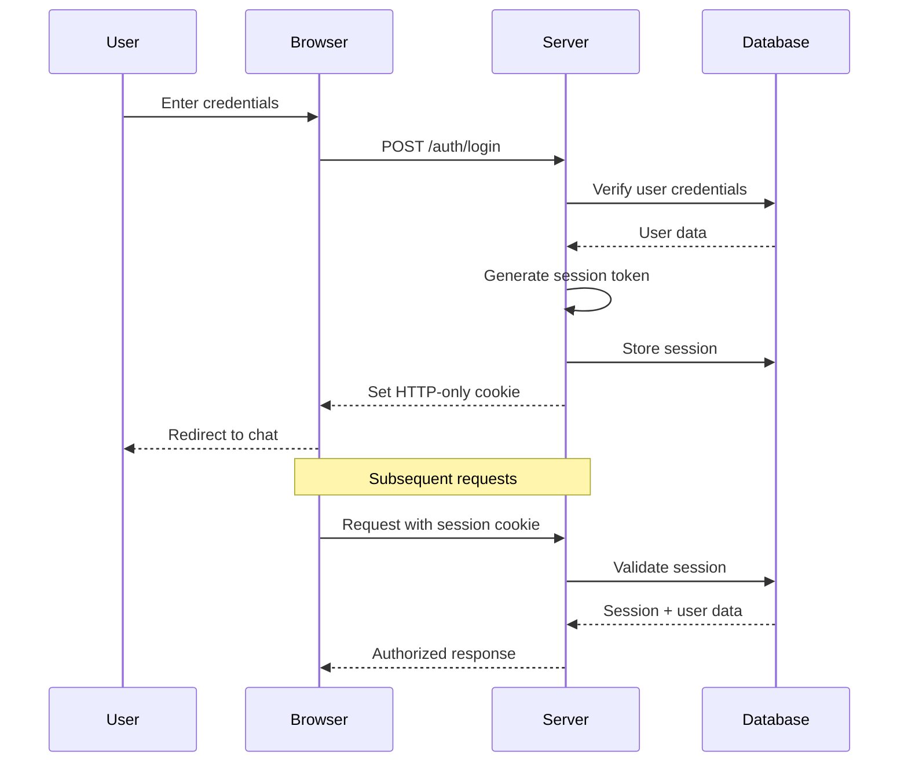

# Authentication Flow

## Overview

The application uses **session-based authentication** with secure HTTP-only cookies. Authentication is handled through custom server-side logic using bcrypt for password hashing and session tokens for user persistence.

## Authentication Architecture



## Implementation Details

### File Structure
```
src/lib/server/auth/
├── index.ts              # Core auth functions
src/routes/(auth)/
├── [authType]/
│   ├── +page.svelte     # Login/Register UI
│   ├── +page.server.ts  # Form actions
│   └── +layout.svelte   # Auth layout
└── signout/
    └── +page.server.ts  # Logout logic
```

### Core Authentication Functions

#### Session Token Generation
```typescript
// src/lib/server/auth/index.ts
export function generateSessionToken(): string {
    const bytes = new Uint8Array(32);
    crypto.getRandomValues(bytes);
    const token = encodeBase32LowerCaseNoPadding(bytes);
    return token;
}
```

#### Session Creation
```typescript
export function createSession(token: string, userId: string): ResultAsync<Session, DbError> {
    return safeTry(async function* () {
        const sessionId = encodeHexLowerCase(sha256(new TextEncoder().encode(token)));
        const session: Session = {
            id: sessionId,
            userId,
            expiresAt: new Date(Date.now() + 1000 * 60 * 60 * 24 * 30) // 30 days
        };
        yield* createSessionDb(session);
        return ok(session);
    });
}
```

#### Session Validation
```typescript
export function validateSessionToken(token: string): ResultAsync<SessionValidationResult, DbError> {
    return safeTry(async function* () {
        const sessionId = encodeHexLowerCase(sha256(new TextEncoder().encode(token)));
        const { user, session } = yield* getFullSession(sessionId);
        
        if (Date.now() >= session.expiresAt.getTime()) {
            yield* deleteSession(sessionId);
            return ok({ session: null, user: null });
        }
        
        // Auto-extend sessions within 15 days of expiry
        if (Date.now() >= session.expiresAt.getTime() - ms('15d')) {
            yield* extendSession(sessionId);
        }
        
        return ok({ session, user });
    });
}
```

### Cookie Management

#### Setting Session Cookie
```typescript
export function setSessionTokenCookie(cookies: Cookies, token: string, expiresAt: Date): void {
    cookies.set('session', token, {
        httpOnly: true,    // Prevent XSS
        sameSite: 'lax',   // CSRF protection
        expires: expiresAt,
        path: '/'
    });
}
```

#### Clearing Session Cookie
```typescript
export function deleteSessionTokenCookie(cookies: Cookies): void {
    cookies.set('session', 'token', {
        httpOnly: true,
        sameSite: 'lax',
        maxAge: 0,
        path: '/'
    });
}
```

## Authentication Routes

### Login/Register Page
**Location**: `src/routes/(auth)/[authType]/+page.svelte`

```svelte
<script lang="ts">
    import AuthForm from '$lib/components/auth-form.svelte';
    import type { PageProps } from './$types';
    
    let { data, form } = $props();
</script>

<AuthForm authType={data.authType} {form} />
```

### Form Actions
**Location**: `src/routes/(auth)/[authType]/+page.server.ts`

```typescript
export const actions: Actions = {
    default: async (event) => {
        const { request, cookies, params } = event;
        const formData = await request.formData();
        const authType = params.authType as 'login' | 'register';
        
        if (authType === 'register') {
            return handleRegister(formData, cookies);
        } else {
            return handleLogin(formData, cookies);
        }
    }
};
```

#### Registration Handler
```typescript
async function handleRegister(formData: FormData, cookies: Cookies) {
    const email = formData.get('email') as string;
    const password = formData.get('password') as string;
    
    // Validation
    if (!email || !password) {
        return fail(400, { error: 'Email and password required' });
    }
    
    // Check if user exists
    const existingUser = await getUserByEmail(email);
    if (existingUser.isOk()) {
        return fail(400, { error: 'User already exists' });
    }
    
    // Hash password and create user
    const hashedPassword = await bcrypt.hash(password, 10);
    const user = await createUser({ email, password: hashedPassword });
    
    if (user.isErr()) {
        return fail(500, { error: 'Failed to create user' });
    }
    
    // Create session
    const sessionToken = generateSessionToken();
    const session = await createSession(sessionToken, user.value.id);
    
    if (session.isOk()) {
        setSessionTokenCookie(cookies, sessionToken, session.value.expiresAt);
        throw redirect(303, '/');
    }
    
    return fail(500, { error: 'Failed to create session' });
}
```

#### Login Handler
```typescript
async function handleLogin(formData: FormData, cookies: Cookies) {
    const email = formData.get('email') as string;
    const password = formData.get('password') as string;
    
    // Get user by email
    const userResult = await getUserByEmail(email);
    if (userResult.isErr()) {
        return fail(400, { error: 'Invalid credentials' });
    }
    
    // Verify password
    const isValid = await bcrypt.compare(password, userResult.value.password);
    if (!isValid) {
        return fail(400, { error: 'Invalid credentials' });
    }
    
    // Create session
    const sessionToken = generateSessionToken();
    const session = await createSession(sessionToken, userResult.value.id);
    
    if (session.isOk()) {
        setSessionTokenCookie(cookies, sessionToken, session.value.expiresAt);
        throw redirect(303, '/');
    }
    
    return fail(500, { error: 'Failed to create session' });
}
```

### Logout Handler
**Location**: `src/routes/(auth)/signout/+page.server.ts`

```typescript
export const load: PageServerLoad = async ({ cookies, locals }) => {
    if (locals.session) {
        await invalidateSession(locals.session.id);
    }
    deleteSessionTokenCookie(cookies);
    throw redirect(303, '/');
};
```

## Hooks and Middleware

### Server Hooks
**Location**: `src/hooks.server.ts`

```typescript
export const handle: Handle = async ({ event, resolve }) => {
    const sessionToken = getSessionCookie(event);
    
    if (!sessionToken) {
        event.locals.user = null;
        event.locals.session = null;
        return resolve(event);
    }
    
    const result = await validateSessionToken(sessionToken);
    
    if (result.isOk() && result.value.session) {
        event.locals.user = result.value.user;
        event.locals.session = result.value.session;
    } else {
        event.locals.user = null;
        event.locals.session = null;
        deleteSessionTokenCookie(event.cookies);
    }
    
    return resolve(event);
};
```

### Universal Hooks
**Location**: `src/hooks.ts`

```typescript
export const reroute: Reroute = ({ url }) => {
    // Redirect auth paths to proper routes
    if (url.pathname === '/login') {
        return '/auth/login';
    }
    if (url.pathname === '/register') {
        return '/auth/register';
    }
};
```

## Route Protection

### Layout Server Load
**Location**: `src/routes/(chat)/+layout.server.ts`

```typescript
export const load: LayoutServerLoad = async ({ locals, cookies }) => {
    const { user, session } = locals;
    
    // Allow anonymous chats if configured
    if (!user && !allowAnonymousChats) {
        throw redirect(303, '/auth/login');
    }
    
    return {
        user,
        // ... other data
    };
};
```

### Page-level Protection
```typescript
// In any +page.server.ts
export const load: PageServerLoad = async ({ locals }) => {
    if (!locals.user) {
        throw redirect(303, '/auth/login');
    }
    
    // Protected page logic
};
```

## Client-side Authentication State

### User Context
```typescript
// src/lib/hooks/auth.svelte.ts
export class AuthState {
    user = $state<User | null>(null);
    
    constructor(initialUser: User | null) {
        this.user = initialUser;
    }
    
    isAuthenticated = $derived(!!this.user);
    
    logout() {
        window.location.href = '/auth/signout';
    }
}
```

### Component Usage
```svelte
<script lang="ts">
    import { getContext } from 'svelte';
    
    const auth = getContext<AuthState>('auth');
</script>

{#if auth.isAuthenticated}
    <p>Welcome, {auth.user?.email}!</p>
    <button onclick={() => auth.logout()}>Logout</button>
{:else}
    <a href="/auth/login">Login</a>
{/if}
```

## Security Considerations

### Password Security
- **Hashing**: bcrypt with cost factor 10
- **Validation**: Minimum length requirements
- **Storage**: Never store plaintext passwords

### Session Security
- **HTTP-Only**: Prevents XSS attacks
- **SameSite**: CSRF protection
- **Secure**: HTTPS only in production
- **Expiration**: Auto-expire and cleanup

### Token Security
- **Random Generation**: Cryptographically secure
- **Hashing**: Session IDs are hashed
- **Rotation**: Consider implementing token rotation

### Input Validation
```typescript
// Validation schemas (recommend Zod)
const loginSchema = z.object({
    email: z.string().email(),
    password: z.string().min(8)
});
```

## Environment Configuration

### Required Environment Variables
```bash
# No additional auth-specific env vars required
# Uses database and crypto APIs
```

### Anonymous Chat Support
```bash
PUBLIC_ALLOW_ANONYMOUS_CHATS=true  # Allow guests
PUBLIC_ALLOW_ANONYMOUS_CHATS=false # Require authentication
```

## Error Handling

### Auth Errors
```typescript
export enum AuthError {
    InvalidCredentials = 'Invalid email or password',
    UserExists = 'User already exists',
    SessionExpired = 'Session has expired',
    SessionInvalid = 'Invalid session'
}
```

### Client Error Display
```svelte
{#if form?.error}
    <div class="error-banner">
        {form.error}
    </div>
{/if}
```

## Testing Authentication

### Unit Tests
```typescript
import { validateSessionToken } from '$lib/server/auth';

test('validates valid session', async () => {
    const result = await validateSessionToken(validToken);
    expect(result.isOk()).toBe(true);
});

test('rejects expired session', async () => {
    const result = await validateSessionToken(expiredToken);
    expect(result.value).toEqual({ session: null, user: null });
});
```

### Integration Tests
```typescript
test('login flow', async () => {
    const response = await fetch('/auth/login', {
        method: 'POST',
        body: new FormData([
            ['email', 'test@example.com'],
            ['password', 'password123']
        ])
    });
    
    expect(response.status).toBe(303);
    expect(response.headers.get('set-cookie')).toContain('session=');
});
``` 